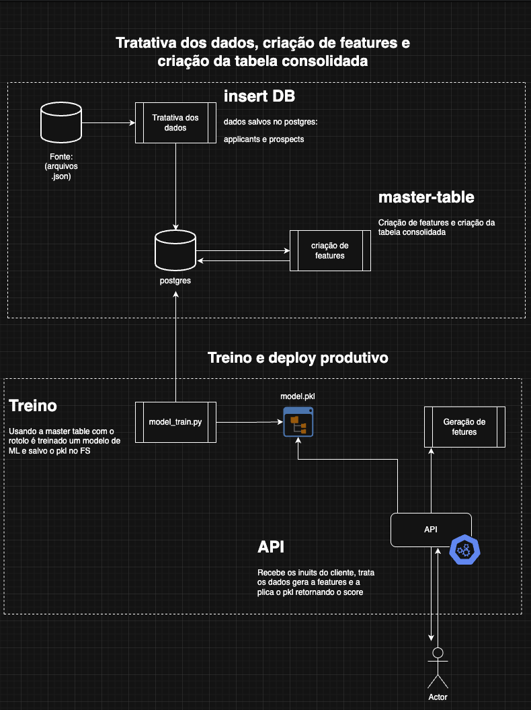

# 🧠 Projeto: Datathon MLET3

## 🎯 Objetivo

Desenvolver um pipeline completo de Machine Learning para predição de contratação de candidatos com os seguintes requisitos:

- ✅ **Treinamento do modelo preditivo**: construção de uma pipeline com *feature engineering*, pré-processamento, treino e validação.
- ✅ **Serialização**: salvamento do modelo final com `pickle` ou `joblib` para uso posterior.
- ✅ **API para deployment do modelo**: desenvolvimento de uma API com Flask contendo um endpoint `/predict` para inferência em tempo real.
- ✅ **Containerização**: empacotamento da API via `Dockerfile`, garantindo replicabilidade e isolamento.
- ✅ **Deploy do modelo**: execução local (ou em nuvem) da aplicação em ambiente Dockerizado.
- ✅ **Testes da API**: validação do endpoint `/predict` com `curl` e `Postman`.
- ✅ **Testes unitários**: implementação de testes para garantir qualidade da pipeline e da API.
- ✅ **Monitoramento contínuo**: logging e estrutura inicial para acompanhamento de *drift*.

---

## 📁 Funcionalidades já implementadas



### 📌 Ingestão e pré-processamento

- Criação de scripts para ingestão dos dados de **aplicantes** e **prospects**.
- Tratamento de valores nulos, `NaN`, strings vazias e representações como `'na'`, `'n/a'`, `'none'`.
- Conversão e limpeza das colunas categóricas e binárias.

---

## 🧪 Features utilizadas no modelo

### 📌 Indicadores de origem:
- `ind_colaborador`
- `ind_cliente`
- `ind_outros`

### 📌 Estado civil (one-hot encoded):
- `estado_civil_vazio`
- `estado_civil_casado`
- `estado_civil_divorciado`
- `estado_civil_solteiro`
- `estado_civil_separado_judicialmente`
- `estado_civil_união_estável`
- `estado_civil_viúvo`

### 🎓 Nível acadêmico (one-hot encoded):
- `nivel_academico_nivel_academico_vazio`
- `nivel_academico_pós_graduacao_completo`
- `nivel_academico_ensino_superior_completo`
- `nivel_academico_mestrado_completo`
- `nivel_academico_ensino_médio_completo`
- `nivel_academico_ensino_técnico_completo`
- `nivel_academico_ensino_superior_incompleto`
- `nivel_academico_ensino_superior_cursando`
- `nivel_academico_pós_graduacao_incompleto`
- `nivel_academico_mestrado_incompleto`
- `nivel_academico_pós_graduacao_cursando`
- `nivel_academico_mestrado_cursando`
- `nivel_academico_ensino_técnico_cursando`
- `nivel_academico_ensino_fundamental_completo`
- `nivel_academico_doutorado_completo`
- `nivel_academico_ensino_técnico_incompleto`
- `nivel_academico_ensino_fundamental_cursando`

### 👔 Nível profissional:
- `nivel_profissional_outros`
- `nivel_profissional_especialista`
- `nivel_profissional_sênior`
- `nivel_profissional_analista`
- `nivel_profissional_júnior`
- `nivel_profissional_pleno`
- `nivel_profissional_líder`

### 🏅 Certificações:
- `certificacoes_count`
- `certificacoes_0`
- `certificacoes_1_3`
- `certificacoes_5_mais`

### 💰 Faixa salarial (binning por tipo):
- `horista0_100`
- `horista_100_300`
- `horista300_500`
- `horista500_1000`
- `mensalista1000_5000`
- `mensalista_5000_10000`
- `mensalista_10k_15k`
- `mensalista20k_mais`

---

## 🎯 Geração do target

- Criação da variável target `contratado` com base em status de contratação.
- Montagem da *master table* unificando as features com a variável target.

---

## 🤖 Treinamento do Modelo

- Modelo utilizado: `LightGBMClassifier`
- Treinamento e validação com `MLflow` para rastreamento de métricas e parâmetros.
- Salvamento do modelo `.pkl` em disco.

---

## 🌐 API Flask

- Desenvolvimento de API local com Flask.
- Endpoint `/predict` que recebe dados JSON, realiza transformação das features e retorna a predição.

---

## 🐳 Docker

- Criação de `Dockerfile` para empacotar a API.
- Execução da API em container local.

---

## ✅ Testes

- Implementação de testes unitários com `pytest`.
- Estrutura de testes localizada em `tests/test_datathon_package`.

---

## 🚀 Como executar

```bash
# Clonar o repositório
git clone https://github.com/seu_usuario/seu_repositorio.git
cd seu_repositorio

docker-compose up
